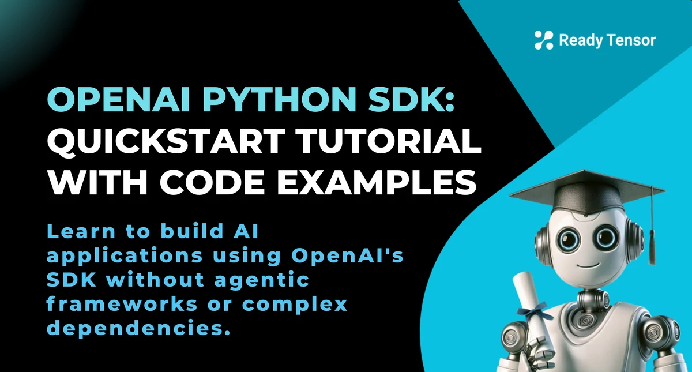
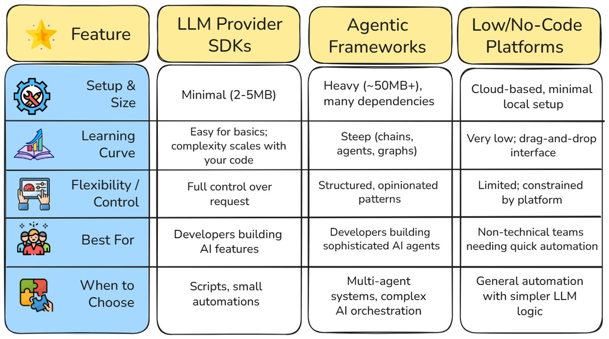
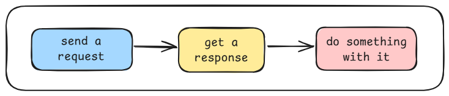
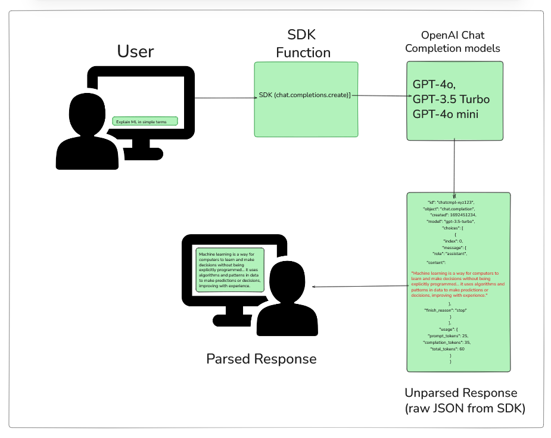

 <!-- RT_DIVIDER -->

---

[🏠 Home - All Lessons](https://app.readytensor.ai/hubs/ready_tensor_certifications)

---

 <!-- RT_DIVIDER -->

# TL;DR

The OpenAI Python SDK makes it simple to integrate powerful AI capabilities—like chat, transcription, vision, and embeddings—without needing complex frameworks or boilerplate code. In this quickstart, you’ll learn how to install the SDK, set up your API key securely, and use the core functions with practical Python examples. By the end, you’ll see how to build AI features directly with the SDK while understanding when frameworks or orchestration tools might be worth adding.

---

 <!-- RT_DIVIDER -->

# SDKs vs Agentic Frameworks: Getting Close to the Bare Metal

Agentic AI is everywhere right now. Frameworks like LangChain, LangGraph, and CrewAI promise to handle orchestration, memory, and multi-step reasoning for you. In this program we use them too — but let’s be clear: you don’t _need_ an agentic framework to build with LLMs.

At the core, all of these frameworks still call into the same **SDKs** that model providers release. SDKs are the “bare metal” layer: minimal abstraction, direct access to capabilities like chat, transcription, vision, and embeddings. Frameworks just wrap those SDKs to reduce boilerplate and enforce structure.

That extra scaffolding can be useful for complex systems, but sometimes all you want is a quick feature or a lightweight script. In those cases, working directly with the SDK is faster, simpler, and gives you more control.

In this lesson, we’ll focus on the **OpenAI Python SDK** — walking through installation, setup, and a few core functions so you can see how to build directly on top of OpenAI’s APIs. Later, we’ll also cover the **OpenAI Agents SDK**, which takes things further into multi-agent orchestration — OpenAI’s answer to LangGraph.

---

 <!-- RT_DIVIDER -->

# Why Use the OpenAI SDK?

So what makes OpenAI’s SDK worth picking up first? Because it lets you drop AI into everyday workflows without dragging in a heavy framework.

Think about the small, repetitive tasks you could automate: summarizing a Slack thread so your team doesn’t miss the point. Turning a five-minute meeting recording into searchable notes. Pulling legible text out of a whiteboard photo after a brainstorming session. These are all cases where a few lines of code with the **OpenAI SDK** can save hours.

So why OpenAI’s SDK in particular (vs SDKs by other LLM providers)? Two reasons stand out:

1.  **Maturity and ecosystem.** It’s battle-tested, actively maintained, and backed by extensive docs, tutorials, and community examples. If you find a snippet online, odds are it “just works” here.
2.  **Industry adoption.** OpenAI’s API design has become the de-facto standard — so much so that competitors like Google and Anthropic now expose OpenAI-compatible endpoints (we’ll look at that later in this lesson).

The result: a toolkit that’s lightweight, flexible, and increasingly interoperable. You can start small, stay close to the **bare metal**, and only add complexity when you really need it.

---

 <!-- RT_DIVIDER -->

# Choosing Your Layer: SDKs, Frameworks, or Low-Code

When building with LLMs, you have a choice: work close to the raw API, lean on a framework, or skip code entirely with a low-code tool. Each option comes with tradeoffs in setup, flexibility, and control.

Here’s how they stack up at a glance:



So what does this mean in practice?

At the lowest level, some developers prefer working almost at the **bare metal**: sending HTTP requests with `requests` or `curl`, manually setting headers and parsing JSON. It works, but it’s tedious. SDKs take that pain away. They’re thin wrappers that give you direct access to the same endpoints with just a few clean function calls. You stay close to the metal, but without all the plumbing code.

At the other end of the spectrum are **agentic frameworks** like LangChain, LangGraph, AutoGen, CrewAI, or OpenAI’s own Agents SDK. They don’t just wrap the API — they add orchestration, memory, and chaining patterns. That extra scaffolding is invaluable for enterprise-grade assistants or multi-agent systems, but it comes with heavier installs, a steeper learning curve, and less flexibility in how you wire things up.

And then there’s the **low/no-code world** — tools like Zapier, n8n, or Make. These let you skip Python entirely. Drag a few blocks onto a canvas and you’ve got a working Slack bot that summarizes messages with GPT. Perfect for quick automation, but limited by what the platform lets you configure.

Our recommendation? Start with the SDK. You’ll learn the raw building blocks first, so when frameworks enter the picture later, you’ll know exactly what they’re doing under the hood.

---

 <!-- RT_DIVIDER -->

 <!-- RT_DIVIDER -->

# Getting Started with the OpenAI SDK

Let’s get your environment ready. The setup is quick, and once you’re done you’ll be able to make your first API call with just a few lines of Python.

**Step 1: Create an OpenAI account.**
Go to [platform.openai.com](https://platform.openai.com) and sign up if you don’t already have an account.

**Step 2: Generate an API key.**
From your dashboard, create a new API key. This key is how your code authenticates with OpenAI’s servers.

⚠️ **Important:** Treat your API key like a password. Never paste it directly into scripts or share it in public repositories.

**Step 3: Install the package.**

```bash
pip install openai python-dotenv
```

**Step 4: Store your key safely.**
Create a `.env` file in your project root to keep secrets out of your code:

```env
OPENAI_API_KEY=your-api-key-here
```

**Step 5: Initialize the client.**

```python
from openai import OpenAI
import os
from dotenv import load_dotenv

load_dotenv()  # Load variables from .env file
client = OpenAI(api_key=os.getenv("OPENAI_API_KEY"))
```

**Step 6: Run a quick test.**

```python
response = client.chat.completions.create(
    model="gpt-4o-mini",
    messages=[{"role": "user", "content": "Say hello in one short sentence."}]
)

print(response.choices[0].message.content)
```

If everything’s wired up, you should see a short reply like:

```txt
Hello! Nice to meet you.
```

---

 <!-- RT_DIVIDER -->

# Key Functions and How to Use Them

No matter what you’re building, using the OpenAI SDK really boils down to three steps:



1.  **Send a request** with your input (a prompt, some text, an audio file, or an image).
2.  **Get a response** back from the model.
3.  **Do something with it** — display it, store it, or feed it into the next step of your app.

That’s it. Everything else is just a variation of this pattern.

In the next sections, we’ll look at the four most common capabilities — chat completions, audio transcription, image analysis, and text embeddings — each with a simple example you can run in Python.

 <!-- RT_DIVIDER -->

## 1. Chat Completions: Your AI Swiss Army Knife

Imagine a Slack thread that drags on with people repeating themselves, adding side comments, and burying the actual decision. You don’t want to read 20 messages — you just want the gist. That’s where **chat completions** shine.



```python
from openai import OpenAI
import os
from dotenv import load_dotenv

load_dotenv()
client = OpenAI(api_key=os.getenv("OPENAI_API_KEY"))

response = client.chat.completions.create(
    model="gpt-4o-mini",
    messages=[
        {"role": "system", "content": "You are a concise assistant."},
        {"role": "user", "content": """Summarize this Slack thread:

        - John: Can we push the deadline? I'm swamped.
        - Priya: Maybe Monday?
        - Alex: Docs are 80% ready, just need final edits.
        - Sarah: I’ll handle the charts.
        - Priya: Friday might be better so everyone has the weekend free.
        - John: Friday works. Thanks.
        """}
    ]
)

print(response.choices[0].message.content)
```

**Sample output:**

```txt
Summary: Deadline moved to Friday. Docs need final edits. Sarah will handle charts.
```

👉 **Takeaway:** Chat completions are versatile. You can use the same endpoint for summarization, Q\&A, translation, or even lightweight chatbots — all with just a few lines of Python.

**Try it yourself:** Run the code and experiment with different prompts for summarization, translation, or other tasks.

---

 <!-- RT_DIVIDER -->

## 2. Audio Transcription: Turn Speech into Searchable Text

Have a quick meeting recording, a voice memo, or a podcast snippet you’d rather skim as text? The **Whisper model** in the OpenAI SDK makes transcription just a few lines of code.

```python

from openai import OpenAI
import os
from dotenv import load_dotenv

load_dotenv()
client = OpenAI(api_key=os.getenv("OPENAI_API_KEY"))

# Transcribe an audio file
with open("meeting_clip.mp3", "rb") as audio_file:
    transcript = client.audio.transcriptions.create(
        model="whisper-1",
        file=audio_file
    )

print(transcript.text)
```

**Sample output:**

```txt
"Project deadline moved to Friday. Sarah will finish the charts. Docs need final edits."
```

👉 **Takeaway:** Audio transcription is one of the easiest ways to add immediate value — turning unstructured speech into searchable, sharable notes for your team.

:::info{title="Info"}
Whisper supports many audio formats including mp3, mp4, wav, and more. The file size limit is 25MB.
:::

---

 <!-- RT_DIVIDER -->

## 3. Image Analysis: Make Sense of Visual Notes

Ever snapped a photo of a whiteboard after a brainstorm, only to forget half of what it meant? With GPT-4o’s vision capabilities, you can feed the image directly into the SDK and get a clean description or extraction of the content.

```python
from openai import OpenAI
import os, base64
from dotenv import load_dotenv

load_dotenv()
client = OpenAI(api_key=os.getenv("OPENAI_API_KEY"))

# Encode image as base64
def encode_image(image_path):
    with open(image_path, "rb") as f:
        return base64.b64encode(f.read()).decode("utf-8")

base64_image = encode_image("whiteboard.jpg")

response = client.chat.completions.create(
    model="gpt-4o-mini",
    messages=[
        {
            "role": "user",
            "content": [
                {"type": "text", "text": "Summarize the notes from this whiteboard image."},
                {"type": "image_url", "image_url": {"url": f"data:image/jpeg;base64,{base64_image}"}}
            ]
        }
    ]
)

print(response.choices[0].message.content)
```

**Sample output:**

```txt
"Whiteboard notes: Deadline Friday. Sarah = charts. Docs need final edits."
```

👉 **Takeaway:** Vision models let you capture ideas from physical spaces — whiteboards, sketches, or screenshots — and make them digital, searchable, and actionable.

:::info{title="Info"}
GPT-4o and GPT-4o mini support vision capabilities. Images should be under 20MB.
:::

---

 <!-- RT_DIVIDER -->

## 4. Text Embeddings: Smarter Search & Organization

Ever wished you could **search by meaning**, not just keywords? Embeddings turn text into vectors that capture semantic similarity. With them, you can build smarter document search, clustering, or recommendation systems.

```python
from openai import OpenAI
import os
from dotenv import load_dotenv

load_dotenv()
client = OpenAI(api_key=os.getenv("OPENAI_API_KEY"))

response = client.embeddings.create(
    model="text-embedding-3-small",
    input="Deadline moved to Friday. Sarah will handle charts. Docs need edits."
)

embedding = response.data[0].embedding
print(f"Embedding dimension: {len(embedding)}")
print(f"First 5 values: {embedding[:5]}")
```

**Sample output:**

```txt
Embedding dimension: 1536
First 5 values: [-0.012, 0.021, 0.034, -0.008, 0.017]
```

👉 **Takeaway:** Embeddings give you a mathematical “fingerprint” of text, enabling semantic search and clustering that goes far beyond plain keyword matching.

:::tip{title="Tip"}
Use embeddings to measure text similarity by calculating cosine similarity between vectors. The `text-embedding-3-small` model is cost-effective, while `text-embedding-3-large` offers higher accuracy.
:::

---

 <!-- RT_DIVIDER -->

## Mini Challenge: Chain Two Functions Together

Try combining two of the SDK functions you just learned:

- **Step 1:** Use the **audio transcription** API to turn a short voice memo into text.
- **Step 2:** Feed that transcript into a **chat completion** request, asking the model to summarize it in two bullet points.

You’ll end up with a pipeline that takes raw speech and delivers a clean, searchable summary — all in under 20 lines of code.

👉 Once you’ve tried that, think of other combos: summarize text embeddings into clusters, describe an image and then translate it, or search across Slack threads with embeddings before asking the model to draft a recap. The SDK gives you the building blocks — your job is to connect them.

---

 <!-- RT_DIVIDER -->

:::info{title="Info"}

 <h2> Industry Insight: The OpenAI API as a De-Facto Standard </h2>
 
 The skills you’re learning with the OpenAI SDK don’t just apply to OpenAI. Several major providers — including Google (Gemini) and Anthropic (Claude) — now expose **OpenAI-compatible endpoints**.
 
 That means you can often take the same code, swap in a new API key, change the `base_url`, and run it against a different model family:
 
 ```python
 from openai import OpenAI
 import os
 
 # Let's call Google's Gemini with minimal code changes
 client = OpenAI(
     api_key=os.getenv("PROVIDER_API_KEY"),
     base_url="https://provider-endpoint.example.com/v1/openai/"
 )
 
 response = client.chat.completions.create(
     model="provider-model-name",
     messages=[{"role": "user", "content": "Explain AI in a few words."}]
 )
 
 print(response.choices[0].message.content)
 ```
 
 And it doesn’t stop there — platforms like **OpenRouter** aggregate dozens of providers behind this same API spec, so the exact same code can talk to many different models.
 
 👉 **Takeaway:** OpenAI’s API design has quietly become the **lingua franca of LLMs**. Knowing the SDK doesn’t tie you to one provider — it gives you a portable skillset you can reuse across the industry.
 
 :::
 
 ---
 
 <!-- RT_DIVIDER -->
 
 
 :::tip{title="Tip"}
 
 # Tips and Best Practices
 
 Working with the OpenAI SDK is straightforward, but a few habits will save you headaches (and money):
 
 <h2> 1. Secure Your API Keys </h2>
 
 - Never hardcode your API key.
 - Use environment variables or a `.env` file.
 - Keep keys out of GitHub and shared repos.
 
 <h2> 2. Manage Costs and Limits </h2>
 
 - Pick smaller models for lightweight tasks.
 - Track usage so you don’t get surprised by a big bill.
 - Batch requests when possible to save tokens.
 - Don’t always reach for GPT-4 — often `gpt-4o-mini` is more than enough.
 - Set **usage limits and alerts** in your OpenAI dashboard so runaway scripts don’t blow your budget.
 
 <h2> 3. Debug Smarter </h2>
 
 - Wrap calls in `try/except` so errors don’t crash your app.
 - Log responses when testing to see what the API is actually returning.
 - If things fail suddenly, check the [OpenAI status page](https://status.openai.com/).
 
 <h2> 4. Common Pitfalls to Avoid </h2>
 
 - Forgetting to set `max_tokens` and accidentally generating a huge (and costly) output.
 - Mixing up API keys across environments (dev vs prod) — label them clearly.
 
 👉 **Pro Tip:** Start small, test often, then scale up. It keeps your apps fast, cheap, and reliable.
 
 :::
 
 ---
 
 <!-- RT_DIVIDER -->
 
 # Conclusion and Next Steps
 
 You’ve seen how the **OpenAI Python SDK** lets you install it in minutes, connect your key, and start building with chat, transcription, vision, and embeddings. Along the way, we covered security basics, cost control, and common mistakes to avoid — so you can build confidently without surprises.
 
 Where do you go from here? Start experimenting. Swap prompts, models, and parameters to see how outputs change. Try combining features — for example, transcribe audio with Whisper, then summarize it with chat completions. Explore multimodal inputs with images or audio. Or just build something small and useful, like a Slack summarizer or searchable document index.
 
 Frameworks like LangChain or OpenAI’s own Agents SDK add orchestration and multi-agent design patterns — but now you know the raw building blocks they sit on. Start simple, then layer on complexity when the project truly calls for it.
 
 ---
 
 <!-- RT_DIVIDER -->
 
 # Learning Resources
 
 * [OpenAI SDK Documentation](https://platform.openai.com/docs)
 * [OpenAI API Reference](https://platform.openai.com/docs/api-reference)
 * [OpenAI Model Index](https://platform.openai.com/docs/models)
 * [OpenAI GitHub Examples](https://github.com/openai/openai-python)
 
 <!-- RT_DIVIDER -->
 
 ---
 
 [🏠 Home - All Lessons](https://app.readytensor.ai/hubs/ready_tensor_certifications)  
 
 ---
