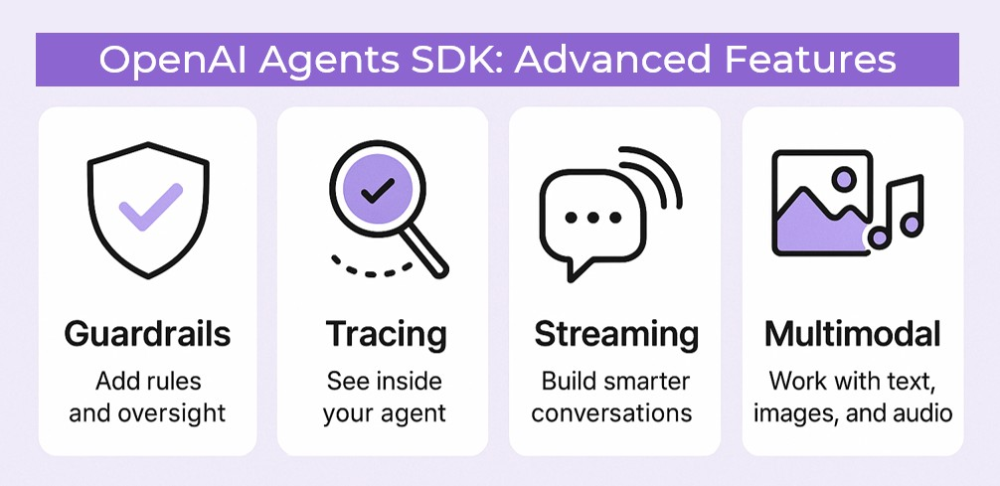

<!-- RT_DIVIDER -->

---

[🏠 Home - All Lessons](https://app.readytensor.ai/hubs/ready_tensor_certifications)

---

<!-- RT_DIVIDER -->

# TL;DR

In this article, you’ll get a friendly, hands-on guide to building AI agents with the **OpenAI Agents SDK**. You’ll learn how to make agents that can **think, act, use tools, follow rules, delegate tasks, and remember context** - basically, AI that actually gets things done. By the end, you’ll be ready to create practical, intelligent applications for text, code, or even multi-modal workflows, all in a smooth and approachable way.

---

<!-- RT_DIVIDER -->

:::info{title="CODE REPOSITORY"}

This lesson comes with an accompanying [GitHub repository](https://github.com/readytensor/rt-agentic-ai-cert-alternative-frameworks) containing all the code examples covered below. We recommend reading through the lesson first to understand the core concepts, then exploring the repo to run and experiment with the agents yourself. It’s the best way to learn by doing.

:::

---

<!-- RT_DIVIDER -->

# Beyond One-Off Prompts: The Case for Agentic SDKs

When people think of AI systems — especially so-called “agentic” ones — they often picture something simple: send a prompt, get back a summary, maybe draft a quick reply. That’s useful, but it’s also just the surface.

Real-world AI applications are rarely that simple. Most practical systems need agents that can **call tools**, **maintain context across API calls**, **take turns in a workflow**, and even **collaborate with other agents**. Suddenly, you’re not just making one model call — you’re dealing with orchestration, memory, delegation, and rules of interaction. That’s a lot more plumbing and architecture than a few lines of prompt code.

This complexity has given rise to entire ecosystems of **agentic frameworks** like LangChain, LangGraph, CrewAI, and AutoGen. These frameworks help developers wire together multi-agent systems with patterns for reasoning, tool use, and collaboration.

But here’s something many developers don’t realize: **OpenAI itself has released a lightweight SDK for building multi-agent systems.** It’s straightforward, flexible, and often the right choice if you want to go beyond single-shot completions without committing to a heavyweight framework.

In this article, we’ll walk through the **OpenAI Agents SDK** — what it is, when to use it, and how to get started building your own agents.

---

<!-- RT_DIVIDER -->

:::info{title="Info"}

<h2>OpenAI SDK vs OpenAI Agents SDK</h2>

Before we dive in, let’s clear up one important point. **OpenAI actually has two different SDKs**, and it’s easy to mix them up:

- The **OpenAI SDK** (no “Agents” in the name) is the standard client library. You’d reach for this when you need **direct model calls** like chat completions, audio transcription, embeddings, or image analysis. It’s lightweight and ideal for quick, single-step features.

- The **OpenAI Agents SDK** (what this lesson is about) is a separate toolkit. Instead of single-shot calls, it lets you build **agents** — systems that can use tools, maintain context across sessions, delegate tasks, and follow rules through guardrails.

So when do you pick one over the other?

- For **atomic tasks** — summarizing text, transcribing audio, generating embeddings — the regular **OpenAI SDK** is usually the better choice.
- For **autonomous or multi-step behavior** — agents that plan, act, and collaborate — the **Agents SDK** is what you’ll want.

👉 To learn more about the regular SDK, check out our [OpenAI Python SDK Quickstart](https://app.readytensor.ai/publications/iyQlDcuqY6kW).

:::

<!-- RT_DIVIDER -->

# What is the Agents SDK?

The OpenAI Agents SDK is a powerful toolkit for building intelligent AI agents that can make decisions, interact with APIs, remember context through sessions, and follow rules. Unlike traditional chatbots that only respond with text, agents created with this SDK can orchestrate complex workflows, call tools, delegate tasks to other agents, and maintain coherent conversations over time. By combining OpenAI’s and other GPT models with function tools and hosted utilities, you can create agents capable of handling real-world tasks with more intelligence and reliability.

With this SDK, you can take projects from simple **chatbots** to sophisticated applications like research assistants querying multiple databases, coding assistants that generate and debug code, or multi-modal agents that analyze images and respond via text or voice. It makes implementing complex agentic behaviors practical and accessible, letting developers focus on designing intelligent workflows rather than reinventing the underlying infrastructure. The result is AI that feels capable, context-aware, and ready to tackle a wide range of real-world problems.

<!-- RT_DIVIDER -->

# Getting Started with the Agents SDK

Let’s roll up our sleeves and get an agent running. We’ll start small: install the right packages, set up a safe place for your API key, and write a minimal Python script that proves the SDK is working.

Think of this like building the foundation. Once the basics are in place, you can layer on tools, sessions, and multi-agent workflows.

---

<!-- RT_DIVIDER -->

<h2> 1. Install the Packages </h2>
 
Create a file called `requirements.txt` in your project folder, and add:
 
 ```txt
 openai
 openai-agents
 python-dotenv
 ```
 
These are the essentials:
 
 - `openai` is the official Python client,
 - `openai-agents` adds the agent SDK, and
 - `python-dotenv` helps you keep secrets out of your code.
 
From your terminal, install everything with:
 
 ```bash
 pip install -r requirements.txt
 ```
 
 ---

<!-- RT_DIVIDER -->

<h2> 2. Create a Virtual Environment </h2>
 
 
It’s good practice to keep dependencies isolated. In your project root, run:
 
**macOS / Linux:**
 
 ```bash
 python3 -m venv venv
 source venv/bin/activate
 ```
 
**Windows (PowerShell):**
 
 ```bash
 python -m venv venv
 .\venv\Scripts\activate
 ```
 
When you’re done, you can leave the environment with:
 
 ```bash
 deactivate
 ```
 
 ---

<!-- RT_DIVIDER -->

<h2> 3. Add Your API Key </h2>
 
Next, create a file called `.env` in your project root and put your API key inside:
 
 ```env
 OPENAI_API_KEY=your_api_key_here
 ```
 
This keeps your key safe and out of source control (remember to add `.env` to `.gitignore` if you’re using Git). You can generate or manage keys from the [OpenAI dashboard](https://platform.openai.com/).
 
 ---

<!-- RT_DIVIDER -->

<h2> 4. Write Your First Agent </h2>
 
Now for the fun part. Let’s create a file called `main.py`:
 
 ```python
 # first_agent.py
 
 from agents import Agent, Runner
 from dotenv import load_dotenv
 
 load_dotenv()
 
 agent = Agent(
     name="AIAssistant",
     instructions="You are a clear, helpful assistant for AI/ML concepts. Keep your answers brief.",
     model="gpt-4o-mini"
 )
 
 # Run the agent synchronously
 result = Runner.run_sync(agent, "Can you explain what an AI agent is in simple terms?")
 print(result.final_output)
 
 ```
 
We have created a simple agent named `AIAssistant` that can explain AI concepts clearly and helpfully.
 
 > **The OpenAI client automatically reads the API key from the environment, so you don’t need to pass it manually.**
 
 ---

<!-- RT_DIVIDER -->

<h2> 5. Run the Script </h2>
 
Fire it up:
 
 ```bash
 python first_agent.py
 ```
 
If everything’s wired up, you’ll see a short, polite answer like:
 
 ```txt
 An AI agent is a computer program that can perceive its environment, make decisions, and take actions to achieve a goal. It works like a smart assistant that senses what's around it and acts accordingly to solve problems or complete tasks.
 ```
 
And just like that, you’ve built your first agent. You can start experimenting with different instructions, questions, and models to see how the agent adapts its responses.
 
This first example is deliberately simple — but it already shows how an agent can take instructions, interpret a user request, and respond in a structured way.
 
 ---
 
👉 At this point, you’ve got the **scaffolding in place**. Next, we’ll look at the building blocks that make the Agents SDK powerful — tools, handoffs, and sessions — so you can take this simple bot and turn it into something much smarter.
 
 ---

<!-- RT_DIVIDER -->

# Building Blocks of OpenAI Agent SDK

Now that you have your first agent running, let's dive deeper into the fundamental components that make the OpenAI Agent SDK so powerful. Understanding these building blocks will help you create more sophisticated and capable AI systems.

<!-- RT_DIVIDER -->

## Agents: The Brain of Your System

Agents are like the brains of your AI system. They don’t just respond with text — they decide how to act. When you give them an instruction, they figure out the best path forward, deciding whether to call a tool, ask you for more details, or pass the task to another agent.

Imagine using Cursor, the AI-powered coding IDE.

You type: _Build me a weather app._

The agent inside Cursor doesn’t simply spit out random code. It evaluates your request, considers what steps are needed (set up a request, call a weather API, build an interface), and then orchestrates those actions.

This ability to make decisions — not just produce output — is what makes agents powerful.

In OpenAI Agents SDK, you define an **Agent** by giving it a name, a set of instructions, and a model. And then you _run_ it with a given prompt to perform tasks while following those instructions.

<!-- RT_DIVIDER -->


<!-- RT_DIVIDER -->

We have already seen how to create a simple agent when we reviewed the setup process. As an exercise, try modifying the agent's instructions to see how it affects the output.

<!-- RT_DIVIDER -->

## Tools: Your Agent's Hands

Agents are great at making decisions, but they need a way to actually _do_ things in the real world. Even the smartest agent can't do much on its own. That's where tools come in. Tools are like plugins the agent can use to extend its abilities. They can be:

- **APIs** (weather data, stock prices, maps)
- **Database queries** (fetching or storing info)
- **Utility functions** (formatting text, running calculations)

Think of tools as the agent’s “hands.” While the agent’s brain figures out what needs to be done, tools are how it actually carries out those tasks. If you ask for today’s weather, the agent doesn’t know it directly — it has to use a tool (the weather API) to get the answer.

<!-- RT_DIVIDER -->

**There are three classes of tools in the Agent SDK:**


<!-- RT_DIVIDER -->

---

<h3> Hosted Tools </h3>
 
Hosted tools are pre-built utilities that OpenAI runs alongside your model. Instead of coding everything yourself, you can give your agent access to tools like:
 
 - `WebSearchTool` for real-time web queries
 - `FileSearchTool` for querying your uploaded documents
 - `CodeInterpreterTool` for running code snippets
 - `ComputerTool` for interacting with local files or the OS
 
Think of hosted tools as extensions: they plug capabilities directly into your agent so it can do more than just generate text.
 
Let’s see a practical example. Suppose you want an assistant that can fetch and summarize the latest AI news headlines. By giving your agent the `WebSearchTool`, it can search the web in real time and return a concise digest:
 
 ```python
 # hosted_tools.py
 
 from agents import Agent, Runner, WebSearchTool
 from dotenv import load_dotenv
 
 load_dotenv()
 
 # Define an agent with a hosted web search tool
 agent = Agent(
     name="AI News Assistant",
     instructions=(
         "You fetch information using WebSearchTool and present it clearly. "
         "Summarize into 3–5 concise bullet points. "
         "Each bullet ≤ 20 words and cite the source in parentheses. "
         "Prefer official blog posts or top-tier outlets. "
         "If little information is found, say 'No major updates.'"
     ),
     tools=[WebSearchTool()],
 )
 
 # Run the agent synchronously
 result = Runner.run_sync(
     agent,
     input="Get today's AI headlines and summarize them as instructed."
 )
 print(result.final_output)
 ```
 
When you run this, the agent uses the hosted web search tool to pull in current headlines and then applies your instructions to shorten and summarize them into a clean bullet-point list.
 
👉 Hosted tools make agents immediately useful for real-world tasks — from searching the web, to querying documents, to running code. And the best part? You don’t have to implement those capabilities yourself — they come baked into the SDK.
 
 ---

<!-- RT_DIVIDER -->

<h3> Function tools </h3>
 
Any Python function can be a tool. The SDK automatically uses function signatures and docstrings to generate input schemas, so agents know how to call them.
 
**Basic `function tool` example with python:**
 
 ```python
 # function_tools.py
 from agents import Agent, Runner, function_tool
 from dotenv import load_dotenv
 
 load_dotenv()
 
 # Define a function tool
 @function_tool
 def calculate_accuracy(correct: int, total: int) -> str:
     """Calculate accuracy given correct predictions and total samples."""
     accuracy = (correct / total) * 100
     return f"Accuracy: {accuracy:.2f}%"
 
 # Create an agent that can use the tool
 agent = Agent(
     name="ML Assistant",
     model="gpt-4o-mini",
     instructions=(
         "You answer machine learning questions clearly. "
         "If a calculation is needed, use the available tools. "
         "Always explain results briefly and clearly."
     ),
     tools=[calculate_accuracy],
 )
 
 # Run the agent with a specific task
 result = Runner.run_sync(
     agent,
     input="A model got 504 correct out of 576 samples. What’s the accuracy?"
 )
 print(result.final_output)
 
 ```
 
When we run this script, we get the following output:
 
 ```txt
 The accuracy of the model is 87.50%. This means the model correctly predicted the outcome for 87.5% of the total samples.
 ```
 
 ---

<!-- RT_DIVIDER -->

<h3>Agents as Tools</h3>
 
Sometimes you want one agent to delegate tasks to other agents — without doing all the work itself. That’s where the **“agents as tools”** pattern comes in.
 
You can turn any agent into a tool and pass it to another agent. This allows you to build **modular, specialized agents** and then create an **orchestrator agent** that coordinates between them. It’s like giving your main agent a team of helpers.
 
Let’s walk through a working example where we build a translation assistant that knows how to delegate to a French or Spanish translator.
 
 ```python
 # agents_as_tools.py
 from agents import Agent, Runner
 from dotenv import load_dotenv
 
 load_dotenv()
 
 # Define specialized agents
 spanish_agent = Agent(
     name="SpanishAgent",
     model="gpt-4o-mini",
     instructions="Translate any input text into Spanish.",
 )
 
 french_agent = Agent(
     name="FrenchAgent",
     model="gpt-4o-mini",
     instructions="Translate any input text into French.",
 )
 
 # Define an orchestrator agent that can call the translators as tools
 orchestrator_agent = Agent(
     name="Orchestrator",
     model="gpt-4o-mini",
     instructions=(
         "You are a translation assistant. "
         "Use the available tools to translate text into the requested language. "
         "Just return the translated text. Do not explain or repeat the original."
     ),
     tools=[
         spanish_agent.as_tool("translate_to_spanish", "Translate to Spanish"),
         french_agent.as_tool("translate_to_french", "Translate to French"),
     ],
 )
 
 # Run the orchestrator synchronously
 result = Runner.run_sync(
     orchestrator_agent,
     input="Translate 'Good morning, everyone!' to French."
 )
 print(result.final_output)
 ```
 
**Sample output:**
 
 ```txt
 Bonjour à tous !
 ```
 
This pattern gives you more flexibility as your systems grow. You can design individual agents for specific capabilities (translation, summarization, coding, etc.) and compose them into larger workflows without rewriting logic.
 
👉 Up next, we’ll look at a more advanced alternative to this pattern — using **handoffs** to give even more control over how agents collaborate.
 
 ---

<!-- RT_DIVIDER -->

## Handoffs: Passing the Baton Between Agents

Turning agents into tools works great for simple delegation — but what if you need more control? That’s where **handoffs** shine.

A handoff is a formal transfer of responsibility from one agent to another. It’s like saying, _“You take it from here,”_ with full awareness and control. Unlike tools, which are called like functions, handoffs give the next agent autonomy to decide how to proceed.

Why use handoffs?

- **Delegate specialized tasks** without micromanaging
- **Keep agents focused** on what they do best
- **Enable real collaboration** across agents or systems
- **Add control** with input validation, callbacks, and richer interactions

When you need more than just a function call, hand it off.

<!-- RT_DIVIDER -->

**Basic `handoff` example with python**

```python
# agent_handoff.py
from agents import Agent, Runner, handoff
from dotenv import load_dotenv

load_dotenv()

# Define specialized agents
spanish_agent = Agent(
    name="SpanishAgent",
    model="gpt-4o-mini",
    instructions="Translate any input text into Spanish.",
)

french_agent = Agent(
    name="FrenchAgent",
    model="gpt-4o-mini",
    instructions="Translate any input text into French.",
)

# Create handoffs (no name argument!)
spanish_handoff = handoff(spanish_agent)
french_handoff = handoff(french_agent)

# Define orchestrator agent with handoffs
orchestrator_agent = Agent(
    name="Orchestrator",
    model="gpt-4o-mini",
    instructions=(
        "You are a translation assistant. "
        "Use the available handoffs to translate input text into the requested language."
    ),
    handoffs=[spanish_handoff, french_handoff],
)

# Run the orchestrator synchronously
result = Runner.run_sync(
    orchestrator_agent,
    input="Translate 'Good night, everyone!' to Spanish."
)
print(result.final_output)

```

---

<!-- RT_DIVIDER -->

## Sessions: Give Your Agents Memory

In real workflows, context matters. With the **OpenAI Agents SDK**, sessions let your agent remember what happened earlier — so it can handle follow-up questions and multi-step tasks without getting confused.

A session stores the full conversation history and automatically includes it with every new run. That’s how an agent knows you’re still talking about the same dataset or model as before.

---

**Example: Data Science Help Desk**

```python
# sessions.py
from agents import Agent, Runner, SQLiteSession
from dotenv import load_dotenv

load_dotenv()

agent = Agent(
    name="DSAssistant",
    instructions=(
        "You are a helpful assistant for data scientists. "
        "Keep responses short (under 50 words) and relevant."
    ),
    model="gpt-4o-mini",
)

session = SQLiteSession("project123")  # Conversation memory


# First question
question1 = "What’s a good metric for imbalanced classification?"
result1 = Runner.run_sync(
    agent,
    question1,
    session=session
)
print("-" * 40)
print("Question 1: ", question1)
print(f"Answer: {result1.final_output}")
print("-" * 40)

# Follow-up question
question2 = "Can I use SkLearn to calculate it?"
print("Question 2 :", question2)
result2 = Runner.run_sync(
    agent,
    question2,
    session=session
)
print(f"Answer: {result2.final_output}")
print("-" * 40)

```

Running the script will produce an output like this:

```txt
--------------------------------------------------------------------------------
Question 1:  What’s a good metric for imbalanced classification?
Answer: A good metric for imbalanced classification is the F1 score, as it balances precision and recall. Other useful metrics include the Area Under the ROC Curve (AUC-ROC) and Matthews Correlation Coefficient (MCC).
--------------------------------------------------------------------------------
Question 2 : Can I use SkLearn to calculate it?
Answer: Yes, you can use Scikit-learn to calculate the F1 score, AUC-ROC, and MCC. Use `sklearn.metrics.f1_score`, `sklearn.metrics.roc_auc_score`, and `sklearn.metrics.matthews_corrcoef` functions respectively.
--------------------------------------------------------------------------------
```

---

**Why Sessions Matter**

- The first message sets the context.
- The second one refers back to that topic.
- **Without a session, the agent wouldn’t make the connection.**

The SDK handles all of this for you — storing, stitching, and passing along history under the hood.

You can use in-memory sessions for quick experiments or a database-backed session (like `SQLiteSession("project123", "memory.db")`) for persistent tracking across runs.

---

<!-- RT_DIVIDER -->

# Using Non-OpenAI Models with the Agents SDK

Here’s something you might not expect: the **OpenAI Agents SDK isn’t limited to OpenAI models**. Thanks to the [LiteLLM](https://github.com/BerriAI/litellm) integration, you can plug in providers like Anthropic, Google, or Mistral with almost no changes to your code.

All it takes is installing one extra dependency group:

```bash
pip install "openai-agents[litellm]"
```

From there, you can spin up agents that talk to non-OpenAI models simply by prefixing them with `litellm/`:

```python
from agents import Agent

claude_agent = Agent(
    name="ClaudeAssistant",
    model="litellm/anthropic/claude-3-5-sonnet-20240620"
)

gemini_agent = Agent(
    name="GeminiAssistant",
    model="litellm/gemini/gemini-2.5-flash-preview-04-17"
)
```

Beyond LiteLLM, the SDK also gives you three other hooks for integrating custom providers:

- **Global client override** with `set_default_openai_client` if you have an OpenAI-compatible endpoint,
- **Run-level provider swap** using `ModelProvider` at `Runner.run`,
- **Agent-level configuration** via `Agent.model` to mix different providers in the same system.

👉 The takeaway: learning the Agents SDK doesn’t lock you into OpenAI. You’re really learning a **portable agent framework** that speaks the common “OpenAI-style” API now adopted across much of the industry.

---

<!-- RT_DIVIDER -->

# Advanced Features in OpenAI Agents SDK



At this point, you’ve learned how to build agents, integrate tools, manage sessions, and even use non-OpenAI models with the SDK. Now it’s time to go a step further.

These advanced features help you **scale your agents**, **improve reliability**, and **prepare your system for real-world deployment**. From guardrails and tracing to streaming and multi-modal input, the SDK gives you the building blocks for production-ready systems.

<h2> Add Rules and Oversight with Guardrails </h2>
 
You can apply lightweight **guardrails** to shape agent behavior and enforce safe, predictable outputs. Want to prevent tool misuse, require confirmation for sensitive actions, or restrict certain responses? Guardrails let you set those rules directly on the agent—no need to hard-code logic for every edge case.
 
<h2> See Inside Your Agent with Tracing </h2>
 
The SDK includes **built-in tracing** to help you understand how your agent makes decisions. You can inspect tool calls, internal state, outputs, and reasoning chains—useful for debugging or improving your workflows. Traces can be printed locally or exported to your own observability tools.
 
<h2> Build Smarter Conversations with Streaming and Realtime Agents </h2>
 
Agents can respond in **realtime**, processing speech or partial text inputs as they come in. This enables use cases like voice assistants, coding copilots, and interactive bots that feel responsive and natural. Streaming support improves both UX and performance by letting agents react incrementally.
 
<h2> Go Multimodal: Work with Text, Images, and Audio </h2>
 
The SDK supports **multi-modal agents** that handle different input types—text, audio, images—in a single interaction. This unlocks rich workflows like “analyze this chart and summarize the key trend” or “listen to this clip and identify the speaker’s intent.” It’s ideal for data science apps, education tools, or accessibility solutions.
 
 ---
 
 > **Want to go deeper?**
 > Check out the [OpenAI Agents SDK documentation](https://openai.github.io/openai-agents-python/). It includes code snippets and configuration tips for all these advanced features.
 
 ---

<!-- RT_DIVIDER -->

# Conclusion & Next Steps

You now have a solid foundation in the OpenAI Agents SDK — from installing it and running your first agent to building richer systems with tools, sessions, and handoffs.

The best way forward is to **start small**. Build an agent that solves one problem well. Then gradually add tools and memory as your needs grow. Once you’re comfortable with single agents, try letting specialized agents work together — that’s when things get interesting.

From there, you can branch into advanced territory: adding guardrails, enabling real-time responsiveness, and building multi-modal workflows that make your systems truly production-ready.

The OpenAI Agents SDK isn’t just about chat. It’s a flexible, lightweight way to build intelligent, autonomous systems that can reason, act, and collaborate.

<p align="center"><strong>Start building. Keep experimenting. Let your agents do the work.</strong></p>

<!-- RT_DIVIDER -->

---

[🏠 Home - All Lessons](https://app.readytensor.ai/hubs/ready_tensor_certifications)

---
